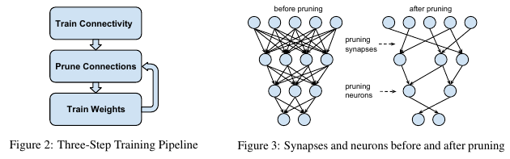
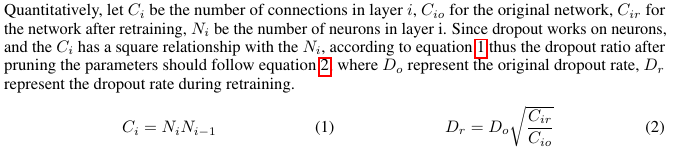

### Learning both Weights and Connections for Efficient Neural Networks -- Paper Note
#### Introduction
Pruning the redundant/unimportant connections using a three-step method in order to reduce the parameters, storage and computations of neural networks and applied to the mobile devices.

#### Problem
1. Significant redundancy for deep learning models.
 + The relative approximation and quantization techniques are orthgonal to network pruning, and can potentially be used together to obtain further gains.
2. Large number of parameters of nerual networks.
3. Complexity and Over-fitting.

#### Method
1. Train the network to learn which connections are important.
2. Prune the unimportant connections.
3. Retrain the network to fine tune the weights of the remaining connections.

#### Achievement
On the ImageNet dataset, reduced the number of parameters of AlexNet by a factor of **9X**, from **61** million to **6.7** million while VGG16 network can be reduced **13X**. All with no loss of accuracy.

#### Detailed Process
1. Train the whole network to learn which are important connections rather than the final values of the weights.
2. Prune the low-weight connections which weights below a set threshold -- converting a dense network into a sparse network.
3. Retain the network to learn the final weights for remaining sparse connections. This step is critical for the accuracy and network performance. Restart from Step 2 iteratively untill the network is stable.

+ **Regularization** : Choose the correct regularization.
 + **L1 regularization** penalizes no-zero parameters resulting in more parameters near zero. This gives better accuracy after pruning, but before retraining.
 + **L2 regulatization** will result in lower accuracy after retraining.

+ **Dropout and Capacity Control**
 + Dropout can prevent over-fitting and applies to retraining. However, this mothod is regarded as ***soft dropout***, since each parameter is not definitely dropped out. The method mentioned in this paper is ***hard dropout***.
 + As the parameters get sparse, the classifier will select the most informative predictors and thus have much less prediction variance which reduces ***over-fitting***.
 + As pruning already reduced model capacity, the retraining dropout ratio should be smaller. As follow :

+ **Local Pruning and Parameter Co-adaptation**
 + During retraining, it is better to retain the weights from the initial training phase for the connections that survived pruning thah it is to re-initialize the pruned layers since CNNs contain ***fragile co-adapted*** features.
 + Dealing with the ***Vanishing gradient problem***, the author fix the paramters for part of network and only retain a shallow network by reusing the surviving parameters, with already co-adapted well with the un-pruned layers during initial training.

+ **Iteraitve Pruning**
 + Pruning followed by a retraining is one iteration, after many such iterations the minimum number conncetions could be found.

+ **Pruning Neurons**
 + After pruning connections, neurons with zero input conncetions or zero output connectiongs may be safely pruned.
