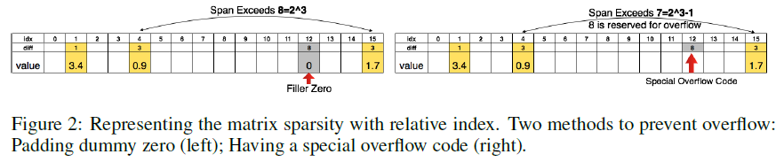
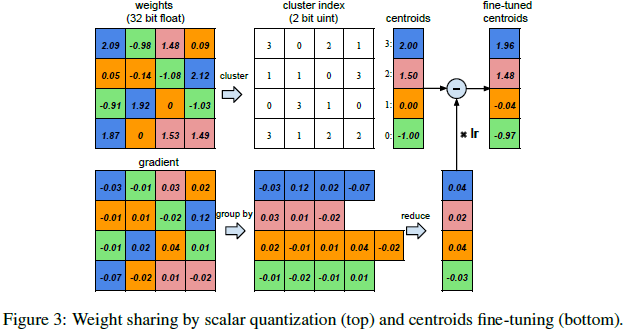
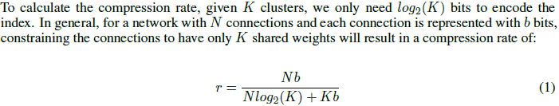
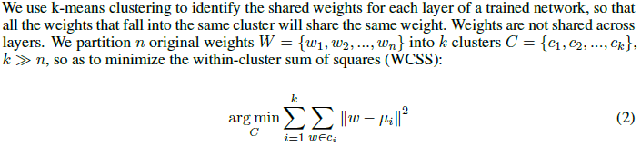
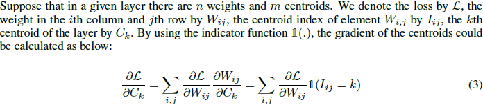

## Deep Compression: Compressing Deep Neural Network with Pruning, Trained Quantization and Huffman Coding -- Paper Note
### Introduction

Compressing the neural networks by a three-stage pipeline: pruning, trained quantization and Huffman coding to reduce the storage requirement without affecting their accuracy. This allows fitting the model into mobile apps given size limit.

### Problem

1. **Computationally intensive** and **memory intensive**, making them difficult to deploy on embedded systems with limited hardware resources.
2. **Large storage overhead** prevents deep neural networks from being incorporated into mobile apps which are very sensitive to the size of the binary files. 
3. **Energy consumption**. Mobile devices are battery constrained, making power-hungry applications such as deep neural networks hard to deploy.

### Method

1. Prune the network by learning only the important conncetions and removing the redundant connections, keeping only the most informative connections.
2. Quantize the weights to enforce weights sharing and apply Huffman coding. As a result, only the codebook(effective weights) and the indices need to be stored.
3. Apply Huffman coding to take advantage of the biased distribution of effective weights.

### Achievement

On the ImageNet dataset, reduced the storage of AlexNet by **35X**, from **240** MB to **6.9** MB while VGG-16 network can be reduced **49X**, from **552** MB to **11.3** MB. All with no loss of accuracy.

### Detailed Process

#### Network Pruning

> Reduce the number of weights

1. Learn the connectivity via normal network training and prune the small-weight connections with below a threshold. Finally retrain the network to learn the final weights for the remaining sparse conncetions. [more details](https://github.com/JackieTseng/paper-notes/blob/master/docs/1/README.md)
2. Store the sparse structure using **compressed sparse row([CSR](http://www.netlib.org/utk/people/JackDongarra/etemplates/node373.html))** or **compressed sparse column([CSC](http://www.netlib.org/utk/people/JackDongarra/etemplates/node374.html))** format, which requires ***2nn + n + 1*** numbers, where ***nnz*** is the number of non-zero elements and ***n*** is the number of rows or columns.
3. Store the index difference instead of the absolute position, and encode this difference in 8 bits for **conv layer** and 5 bits for **fc layer**. When we need an index difference larger than the bound we have two solutions(As the following figure):
	* **Zero padding** : in case when the difference exceeds 8, the largest 3-bit (as an example) unsigned number, we add a dummy zero.
	* **Adding overflow code** : so that 1-7 represent normal jump, while 8 is the overflow code, meaning continue adding the next index difference to get a larger index difference. 

#### Trained Quantization and Weight Sharing

> Reduce the number of bits to represent each weight

1. Limit the number of effective weights needed to store by having multiple connections share the same weight and fine-tune those shared weights. (As the following figure):

2. For each connection, we then need to store only a small index into a table of shared weights.

#### Weight Sharing

#### Initialization of shared weights

> Centroid Initialization

* Forgy(random)
* Density-based
* Linear

> Larger weights play a more important role than smaller weights. However, larger weights have smaller quantity. Thus for both Forgy initialization and density-based initialization, very few centroids have large absolute value which could harm the performance. **Linear initialization** does not suffer from this problem. The experiment section compares the accuracy of different initialization methods after clustering and fine-tuning, showing that linear initialization works best.

#### Feed-forward and Back-propagation

* The centroids of the one-dimensional k-means clustering are the shared weights. There is one level of indirection during feed forward phase and back-propagation phase looking up the weight table. An index into the shared weight table is stored for each connection. During back-propagation, the gradient for each shared weight is calculated and used to update the shared weight.

#### Huffman Coding

* Huffman coding can be efficiently implemented, finding a code in linear time to the number of input weights if these weights are sorted. Besides, Huffman code is a loss-less compression method, so the accuracy of the network won¡¯t be affected. Experiments shown Huffman coding could save the last 20% - 30% storage of the network weights.

### Experiment

* Training is performed with Caffe framework. Pruning is implemented by adding a mask to the blobs and mask out the update of those pruned connections. Quantization and weight sharing are implemented by maintaining a codebook structure that stores the shared weight, and group-by-index after calculating the gradient of each layer, then update the shared weight with all the gradients that fall into that bucket. Huffman coding doesn¡¯t require training and is implemented offline after all the fine-tuning is finished.

### Discussions

* **Pruning and Quantization** working together receives the best compression rate and performance.
* **Linear Initizlization** outperforms the density initialization and random initialization.

### Q & A
1. How does the index-difference-encoding method works in pruning?
2. How does the weight-sharing method works in quantizating?
