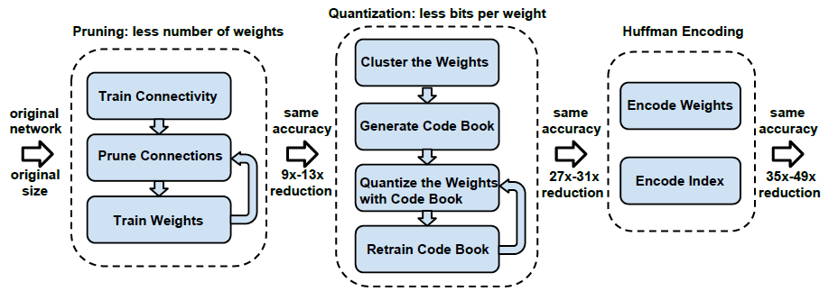
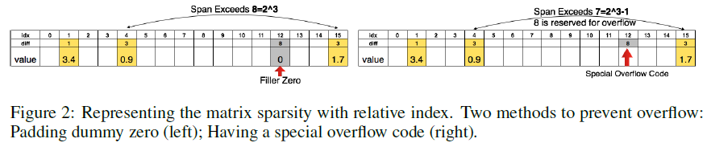

## Deep Compression: Compressing Deep Neural Network with Pruning, Trained Quantization and Huffman Coding -- Paper Note
### Introduction

Compressing the neural networks by a three stage pipeline: pruning, trained quantization and huffman coding to reduce the storage requirement. This allows fitting the model into mobile apps given size limit.

### Problem

1. **Computationally intensive** and **memory intensive**, making them diffcult to deploy on embedded systems with limited hardware resources.
2. **Large storage overhead** prevents deep neural networks from being incorporated into mobile apps which are very sensitive to the size of the binary files. 
3. **Energy consumption**. Mobile devices are battery constrained, making power hungry applications such as deep neural networks hard to deploy

### Method

1. Prunes the network by learning only the important conncetions and removing the redundant connections, keeping only the most informative connections.
2. Quantiza the wights to enforce weight sharing and apply Huffman coding. As a result, only the codebook(effective weights) and the indices need to be stored.
3. Retrain the network to fine tune the remaining connections and the quantized centroids.

### Achievement

On the ImageNet dataset, reduced the storage of AlexNet by **35X**, from **240** MB to **6.9** MB while VGG-16 network can be reduced **49X**, from **552** MB to **11.3** MB. All with no loss of accuracy.

### Detailed Process

#### Network Pruning

1. Learn the connectivity via normal network training and prune the small-weight connections with below a threshold. Finally retrain the network to learn the final weights for the remaining sparse conncetions. [more details](https://github.com/JackieTseng/paper-notes/blob/master/docs/1/README.md)
2. Store the sparese structure using **compressed sparse row([CSR](http://www.netlib.org/utk/people/JackDongarra/etemplates/node373.html))** or **compressed sparse column([CSC](http://www.netlib.org/utk/people/JackDongarra/etemplates/node374.html))** format, which requires ***2nn + n + 1*** numbers, where **nnz** is the number of non-zero elements and n is the number of rows or columns.
3. Store the index difference instead of the absolute position, and encode this difference in 8 bits for conv layer and 5 bits for fc layer. When we need an index difference larger than the bound we have two solutions(As the following figures):
	* **Zero padding** : in case when the difference exceeds 8, the largest 3-bit (as an example) unsigned number, we add a dummy zero.
	* **Adding overflow code** : so that 1-7 represent normal jump, while 8 is the overflow code, meaning continue adding the next index difference to get a larger index difference. 

#### Trained Quantization and weight sharing

### Experiment
