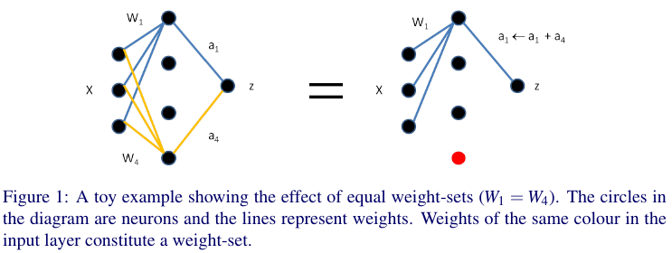
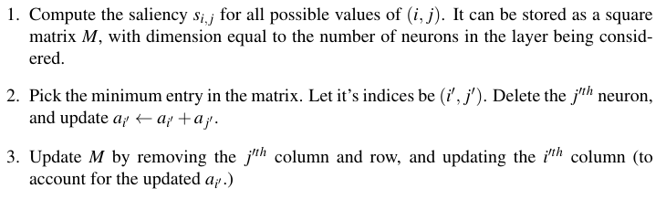

## Data-free Parameter Pruning for Deep Neural Networks -- papre note
### Introduction

Compressing the neural network by removing neurons in a systematic way.

### Problem

Much smaller models can achieve similar levels of performance as Deep Neural nets.

### Method

* Main Idea

> Wiring similar neurons together

* Main steps

### Achievement

Remove upto **85%** of the total parameters in a MNIST-trained network, and about **35%** for AlexNet without significantly affecting performance.

### Detailed Process

### Experiment

### Discussions

### Q & A
